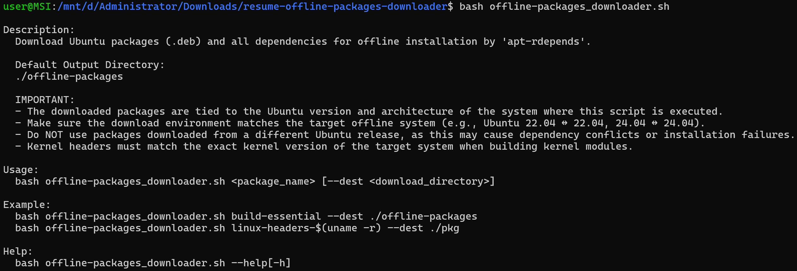

# Introduction
Download Ubuntu packages (.deb) and all dependencies for offline installation by `apt-rdepends`.

## Default Output Directory
`./offline-packages`

## IMPORTANT
- The downloaded packages are tied to the Ubuntu version and architecture of the system where this script is executed.
- Make sure the download environment matches the target offline system (e.g., Ubuntu 22.04 ↔ 22.04, 24.04 ↔ 24.04).
- Do NOT use packages downloaded from a different Ubuntu release, as this may cause dependency conflicts or installation failures.
- Kernel headers must match the exact kernel version of the target system when building kernel modules.

# Usage
```
bash offline-packages_downloader.sh <package_name> [--dest <download_directory>]
```

# Example
```
bash offline-packages_downloader.sh build-essential --dest ./offline-packages
bash offline-packages_downloader.sh linux-headers-$(uname -r) --dest ./pkg
```

# Help
```
bash offline-packages_downloader.sh --help[-h]
```


